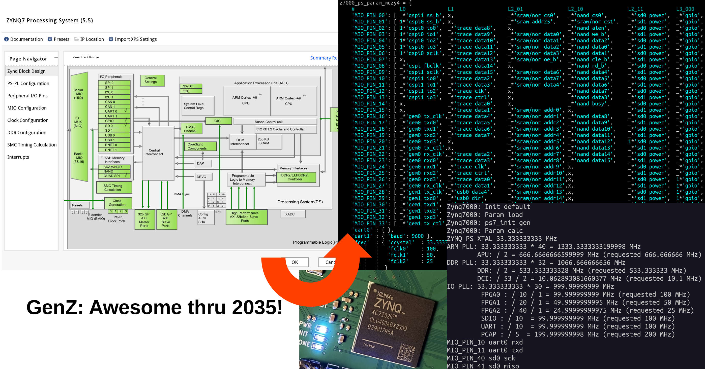

## GenZ: the open-source Zynq 7000 BSP generator

[Awesome through 2035!](https://www.hackster.io/news/product-lifecycle-extension-for-all-7-series-xilinx-devices-through-2035-4b690dac2d42)

GenZ is a FOSS BSP generator for the Zynq 7000 Processing System (PS). It emits the `ps7_init.c`, `ps7_init.h` and `xparameters.h` required for FSBL building and PS software development, from a simple, text-based configuration. 

Together with [Xilinx embeddedsw](https://github.com/regymm/embeddedsw), [OpenXC7](https://github.com/openXC7/), and [Antmicro zynq-mkbootimage](https://github.com/antmicro/zynq-mkbootimage), full Zynq 7000 PS/PL development can be done with NO PROPRIETY TOOLS. 

#### Get started

`python3 zynq7000_user.py` -- you can modify it to fit your board. 

Two sets of BSPs will be generated at `ps7_init_pynqz1` and `ps7_init_muzy4`. 

#### FSBL and User App

#### BOOT.BIN

