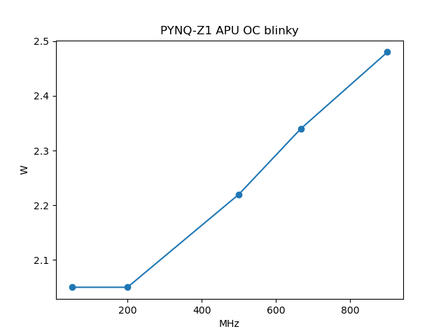

### 🔥1. APU Overclock

We can set the ARM cores' frequency higher than the 667 MHz limit -- with GenZ, it's as easy as changing one parameter. 

This demo uses the same bitstream as `3-emio`, but the C program is modified to a blinky. Change the APU frequency in `apu_oc.py` and see how far your board can get!

I got up to 900 MHz with this simplest blinky and loading via JTAG. The power consumption seems to scale linearly with frequency. 

